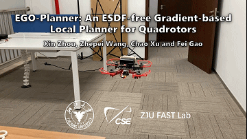
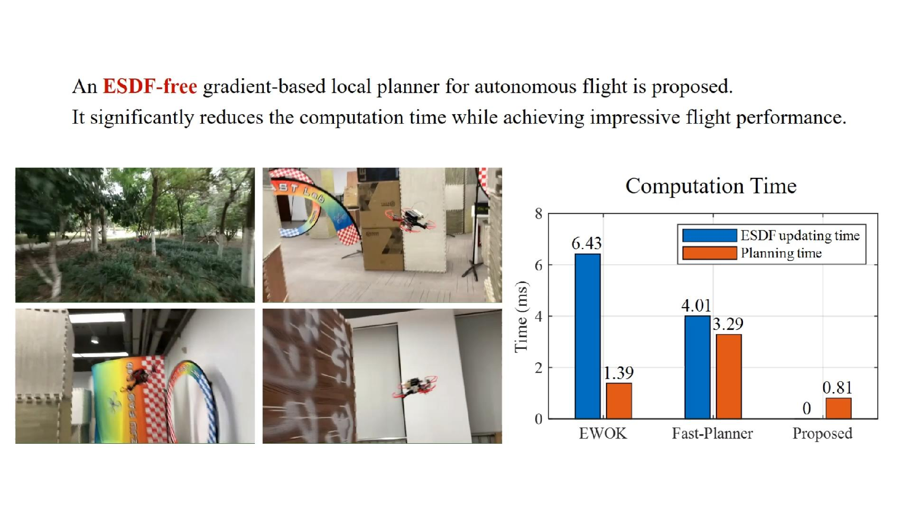
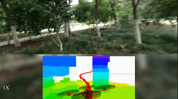

# Quick Start within 3 Minutes
Compiling tests on ubuntu 16.04, 18.04 and 20.04 with ros installed all passed.
You just execute the commands one by one.
```
sudo apt-get install libarmadillo-dev
git clone https://github.com/bigsuperZZZX/ego_planner.git
cd ego-planner
catkin_make
source devel/setup.bash
roslaunch ego_planner simple_run.launch
```
If your link to github is slow, I recommend you to try the gitee repository [https://gitee.com/iszhouxin/ego_planner](https://gitee.com/iszhouxin/ego_planner). They synchronize automatically.

# Acknowledgements
The framework of this repository is based on [Fast-Planner](https://github.com/HKUST-Aerial-Robotics/Fast-Planner) by Zhou Boyu who achieves impressive proformance on quaorotor local planning.

The L-BFGS solver we use is modified by wangzhepei@zju.edu.cn from [xxx](xxx). 
It is a C++ head-only single file, which is lightweight and easy to use.

The map generated in simulation is from [mockamap](https://github.com/HKUST-Aerial-Robotics/mockamap) by Willim Wu.

The hardware architecture is based on an open source implemation from [Teach-Repeat-Replan](https://github.com/HKUST-Aerial-Robotics/Teach-Repeat-Replan).

# EGO-Planner 
EGO-Planner: An ESDF-free Gradient-based Local Planner for Quadrotors

**EGO-Planner** is a lightweight gradient-based local planner without ESDF construction, which significantly reduces computation time (around 1ms) compared to some state-of-the-art methods <!--(EWOK and Fast-Planner)-->.

<p align = "center">




</p>

**Video Links:** [YouTube](https://youtu.be/UKoaGW7t7Dk), [bilibili](https://www.bilibili.com/video/BV1VC4y1t7F4/) (for Mainland China)

## 1. Standard Compilation

**Requirements**: ubuntu 16.04, 18.04 or 20.04 with ros-desktop-full installation.

**Step 1**: install [Armadillo](http://arma.sourceforge.net/), which is required by **uav_simulator**.
```
sudo apt-get install libarmadillo-dev
``` 

**Step 2**: clone the code from github or gitee (for Mainland China). This two repositories synchronize automaticly.

From github
```
git clone https://github.com/bigsuperZZZX/ego-planner.git
```

Or from gitee
```
git clone https://gitee.com/iszhouxin/ego_planner.git
```

**Step 3**: compile.
```
cd ego-planner
catkin_make -DCMAKE_BUILD_TYPE=Release
```

**Step 4**: run.

In a terminal at the _ego-planner_ folder, open the rviz for visuallization and interactions
```
source devel/setup.bash
roslaunch ego-planner rviz.launch
```

In another terminal at the same folder, run the simulation and planner by
```
source devel/setup.bash
roslaunch ego-planner run_in_sim.launch
```

Then you can follow the gif below to select you targets.

<p align = "center">

</p>

## 2. Using an IDE
We recommend using vscode, the project file has been included in the code you cloned, which is the _.vscode_ folder.
This folder is hidden by default.

First, re-compile the code using command
```
catkin_make -DCMAKE_BUILD_TYPE=Release -DCMAKE_EXPORT_COMPILE_COMMANDS=Yes
```
It will export a compile commands file, which can help vscode to determine the code architecture.

Then launch vscode and select the _ego-planner_ folder to open.
```
code ~/<......>/ego-planner/
```

Press Ctrl+Shift+B to compile the code in vscode. This command is defined in _.vscode/tasks.json_.

Then close and restart vscode, you will see the vscode has already known the code architecture and can perform auto completion & jump.

 ## 3.Use GPU or Not
 Packages in this repo, **local_sensing** have GPU, CPU two different versions. By default, they are in CPU version for better compatibility. By changing
 
 ```
 set(ENABLE_CUDA false)
 ```
 
 in the CMakeList.txt in **local_sensing** packages, to
 
 ```
 set(ENABLE_CUDA true)
 ```
 
CUDA will be turned-on to generate depth images as a real depth camera does. 

Please remember to also change the 'arch' and 'code' flags in the line of 
```
    set(CUDA_NVCC_FLAGS 
      -gencode arch=compute_61,code=sm_61;
    ) 
``` 
in 'CMakeList', if you encounter compiling error due to different Nvidia graphics card you use. You can check the right code [here](https://github.com/tpruvot/ccminer/wiki/Compatibility).
 
Don't forget to re-compile the code!

**local_sensing** is the simulated sensors. If ```ENABLE_CUDA``` **true**, it mimics the depth measured by stereo cameras and renders a depth image by GPU. If ```ENABLE_CUDA``` **false**, it will publish pointclouds with no ray-casting. Our local mapping module automatically selects whether depth images or pointclouds as its input.

For installation of CUDA, please go to [CUDA ToolKit](https://developer.nvidia.com/cuda-toolkit)

## 4.Utilize the Full Performance of CPU
The computation time of our planner is too short to let the OS to increase CPU frequency, which makes the computation time tend to be longer and unstable.

Therefore, we recommend that you manually set the CPU frequency to the maximum.
Install this tool by
```
sudo apt install cpufrequtils
```
Then you can set the CPU frequency to the maximum allowed by
```
sudo cpufreq-set -g performance
```
More information can be found in [http://www.thinkwiki.org/wiki/How_to_use_cpufrequtils](http://www.thinkwiki.org/wiki/How_to_use_cpufrequtils).

Note that CPU frequency may still decrease due to high temperature in high load.
 
## 6. Licence
The source code is released under [GPLv3](http://www.gnu.org/licenses/) license.

## 7. Maintaince
We are still working on extending the proposed system and improving code reliability. 

For any technical issues, please contact Xin Zhou (iszhouxin@zju.edu.cn) or Fei GAO (fgaoaa@zju.edu.cn).

For commercial inquiries, please contact Fei GAO (fgaoaa@zju.edu.cn).
